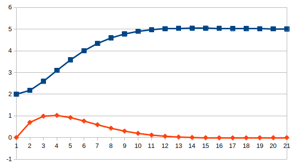
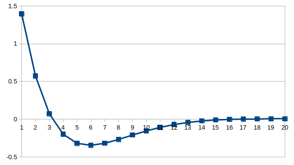

# MPC based on OSQP
* This project gives an example, which can be modified by users.    
* Every block during option start and option end should be modified by users according to the actual situation, where contains printing options and necessary parameters.   
* Need to pre install dependency `Eigen`:    
  `sudo apt-get install libeigen3-dev`      
  `sudo ln -s /usr/include/eigen3/Eigen /usr/include/Eigen`  
* Need to pre install dependency `OSQP-0.4.1`, which can be get from:   
  [OSQP](`https://github.com/osqp/osqp`)  
* Provide simple parameter type checking function.  
* The discrete form of the state space equation should be given by users, this project does not provide form transformation function similar to that in project [DLQR](https://github.com/Technician13/DLQR).       
* In `main` function, a loop is used to simulate the normal operation of a classical 1-dim position-velocity-acceleration system, the period of sampling is set to `0.5` and the number of iterations is `20`.     

$$\begin{bmatrix}p_{k+1}\\\\v_{k+1}\end{bmatrix} =
  \begin{bmatrix}1 & T\\\\0 & 1\end{bmatrix} \cdot \begin{bmatrix}p_{k}\\\\v_{k}\end{bmatrix} + 
  \begin{bmatrix}\frac{1}{2} \cdot T^2 \\\\T\end{bmatrix} \cdot u_k$$    

* Specific derivation process can be seen in [Appendix A](#appendix-a), all variables' names are the same as those in the code.  
* Prediction time domain `horizon` of MPC is set to 3, so the weight matrices `H` nad `g` are simply formatted as identity matrices as follows:       
$$\boldsymbol{H} =  \boldsymbol{1}_{6\times6}$$
$$\boldsymbol{g} =  \boldsymbol{1}_{3\times3}$$
 

* The test result is as the follow  figure, as the time going, the state variable of the system converge to `(5, 0)` from the initial state`(2, 0)`. :        

  

* The follow figure display the change process of the input of the whole system, in this sample, the input is limited between `-2` and `2`.

  

 

# Appendix A    
* Assum that the prediction time domain `horizon` of MPC is set to `3`:  

$$
\begin{align}
\boldsymbol{x}_{k+1} &= \boldsymbol{A} \cdot \boldsymbol{x}_{k} + \boldsymbol{B} \cdot \boldsymbol{u}_{k}
\end{align}
$$

$$
\begin{align}
\boldsymbol{x}_{k+2} &= \boldsymbol{A} \cdot \boldsymbol{x}_{k+1} + \boldsymbol{B} \cdot \boldsymbol{u}_{k+1} \notag \\
&= \boldsymbol{A} \cdot [ \boldsymbol{A} \cdot \boldsymbol{x}_{k} + \boldsymbol{B} \cdot \boldsymbol{u}_{k} ] + \boldsymbol{B} \cdot \boldsymbol{u}_{k+1} \notag \\
&= \boldsymbol{A}^2 \cdot \boldsymbol{x}_{k} + \boldsymbol{A} \cdot \boldsymbol{B} \cdot \boldsymbol{u}_{k} + \boldsymbol{B} \cdot \boldsymbol{u}_{k+1}
\end{align}
$$

$$
\begin{align}
\boldsymbol{x}_{k+3} &= \boldsymbol{A} \cdot \boldsymbol{x}_{k+2} + \boldsymbol{B} \cdot \boldsymbol{u}_{k+2} \notag \\
&= \boldsymbol{A} \cdot [ \boldsymbol{A}^2 \cdot \boldsymbol{x}_{k} + \boldsymbol{A} \cdot \boldsymbol{B} \cdot \boldsymbol{u}_{k} + \boldsymbol{B} \cdot \boldsymbol{u}_{k+1} ] + \boldsymbol{B} \cdot \boldsymbol{u}_{k+2} \notag \\
&= \boldsymbol{A}^3 \cdot \boldsymbol{x}_{k} + \boldsymbol{A}^2 \cdot \boldsymbol{B} \cdot \boldsymbol{u}_{k} + \boldsymbol{A} \cdot \boldsymbol{B} \cdot \boldsymbol{u}_{k+1} + \boldsymbol{B} \cdot \boldsymbol{u}_{k+2}
\end{align}
$$

* Write equations（1）, (2) and (3) into one equation:     
$$
\begin{align}
\begin{bmatrix}\boldsymbol{x}_{k+1}\\\\\boldsymbol{x}_{k+2}\\\\\boldsymbol{x}_{k+3}\end{bmatrix} &= \begin{bmatrix}\boldsymbol{A}\\\\\boldsymbol{A}^2\\\\\boldsymbol{A}_3\end{bmatrix} \cdot \boldsymbol{x}_{k} + \begin{bmatrix}\boldsymbol{B} &  &  \\\\\boldsymbol{A} \cdot \boldsymbol{B} & \boldsymbol{B} & \\\\\boldsymbol{A}^2 \cdot \boldsymbol{B} & \boldsymbol{A} \cdot \boldsymbol{B} & \boldsymbol{B}\end{bmatrix} \cdot \begin{bmatrix}\boldsymbol{u}_{k}\\\\\boldsymbol{u}_{k+1}\\\\\boldsymbol{u}_{k+2}\end{bmatrix}
\end{align}
$$    

* Equation (4) can be written as:   
$$
\begin{align}
\boldsymbol{X} &= \boldsymbol{\Phi} \cdot \boldsymbol{x}_{k} + \boldsymbol{\Psi} \cdot \boldsymbol{U}
\end{align}
$$

* Then, the desired state sequence $\boldsymbol{X}_{ref}$ should be given and the objective function of QP problem can be described as:

